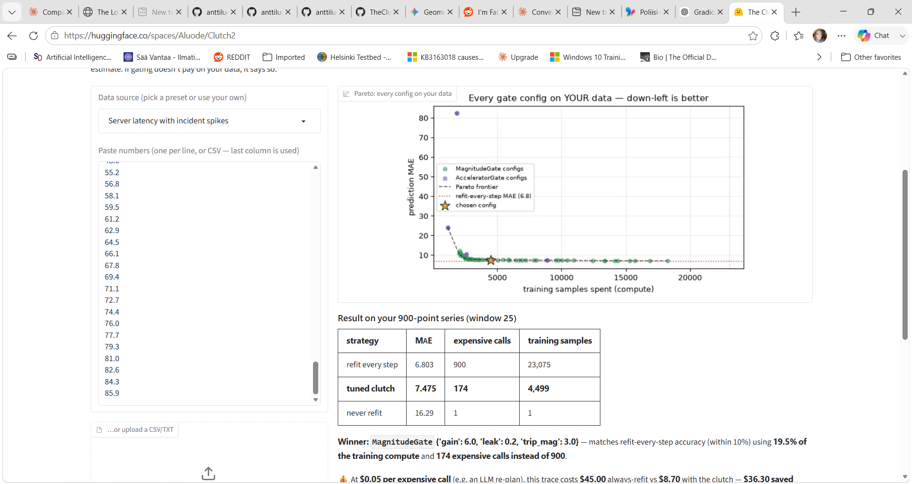

---
title: The Clutch
emoji: 🔌
colorFrom: green
colorTo: gray
sdk: gradio
sdk_version: 6.19.0
app_file: app.py
pinned: false
license: mit
short_description: Spend expensive compute only when reality drifts.
---

# 🔌 The Clutch — *spend expensive compute only when reality drifts*

Live at huggingface spaces: 

https://huggingface.co/spaces/Aluode/Clutch2

A **substrate-agnostic dual-process controller**, distilled from Antti Luode's Loom
Navigator to its one reusable idea, then given a live demo you can *watch*.

> Run a **cheap cached policy** by default. Only pay for an **expensive planner** when a
> *surprise* signal trips a **gate**. When things go calm, **latch** the fresh plan back
> into the cache.

`clutch.py` is ~120 lines, has **no dependencies**, and makes **no assumption about what
the substrates are**. You hand it three callbacks — a cheap cached step, an expensive
planner, and a scalar error signal — and pick a gate. That is the whole interface.

## What the Space shows

0. **Tune it on YOUR data** — the tool, not the demo. Paste or upload any 1-D time
   series (latency metric, sensor stream, price feed). The Space runs the real
   closed-loop clutch on it, sweeps ~80 gate configs, plots the accuracy-vs-compute
   Pareto frontier, and returns a **copy-paste `Clutch(...)` config tuned to your data**
   plus a dollar-savings estimate. If gating doesn't pay on your series, it says so.
1. **Watch it navigate** — an agent patrols A↔B on a 60×60 grid while walls with a gap
   drop at scripted times, breaking its cached route. Every maze is *guaranteed solvable*
   (schedules that would disconnect A–B are rejected), so the outcome reflects the gate,
   not luck. You see, frame by frame, when the gate keeps the cheap habit (green) and when
   it trips and pays for a fresh plan (red), with the compute counter running against
   replan-every-step.
2. **Same clutch, different world** — the *identical* `Clutch` class forecasts a streaming
   signal with abrupt regime changes, refitting a model **only when prediction error trips
   the gate**. This is concept-drift-gated retraining; only the three callbacks changed.
3. **The honest benchmark** — reproduce the multi-seed measurement in-browser. Compute is
   counted honestly (BFS cells expanded / training samples fit).
4. **What this is / where it's valuable** — the LLM-agent-loop framing (the expensive call
   is a token-billed re-plan) with drop-in code, plus the honest negative result.

## Headline numbers (reproducible in tab 3)

Grid navigation, 16 seeds, patrol ×3, no sensor noise:

| strategy | success | BFS expanded | plan calls | vs replan-all |
|---|---:|---:|---:|---:|
| ALWAYS_COGNITIVE | 94% | 227,309 | 250.8 | 100.0% |
| ALWAYS_HABITUAL | 0% | 2,221 | 1.0 | brittle |
| **CLUTCH (leaky integrator)** | **100%** | **8,100** | **3.4** | **3.6%** |

The clutch hits the goal *more reliably than replanning every step* (100% vs 94% —
constant replanning occasionally lets a wall seal the agent mid-corridor) while spending
**~1/28th the compute**.

## The honest negative result

The **accelerometer / jerk gate** (2nd-derivative of error, the Park–Cohen framing) is
*not* a free lunch. Under sensor noise it fires ~1.7× more than the leaky integrator and
burns ~50% more compute for the same success; on the drift task it *under*-fires and
fails. Across both substrates the plain **leaky integrator is the better engine here.**
The derivative gate's edge would show on tasks needing *fast* reaction to abrupt change —
which neither of these stresses. Stated, not hidden.

## Files

- `clutch.py` — the controller + gates. Drop-in, zero deps.
- `nav.py` — grid-navigation substrate (frame capture + benchmark).
- `drift.py` — concept-drift substrate driving the *same* `Clutch`.
- `viz.py` — matplotlib rendering (animation + plots).
- `tuner.py` — the bring-your-own-data gate tuner (parse → sweep → Pareto → config).
- `app.py` — the Gradio Space.
- `benchmark_orig.py` — the original headless benchmark. Run: `python3 benchmark_orig.py`.

Built on `clutch.py` / `benchmark.py` by Antti Luode (PerceptionLab). *Do not hype. Do
not lie. Just show.*
